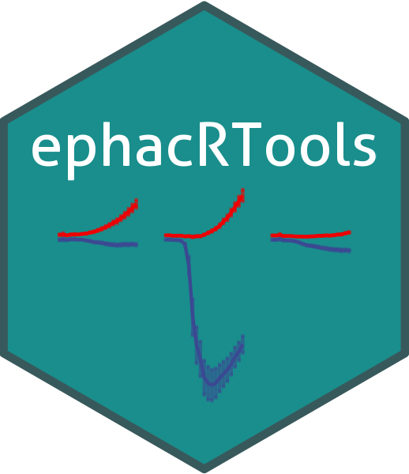

# ephacRTools 

An R package for analyzing **High-Throughput Automated Patch Clamp (HT-APC)** data
from Syncropatch/Nanion instruments, with integrated imaging and interactive visualization.

## Overview

`ephacRTools` bridges the gap between raw electrophysiology exports and downstream analysis
by providing a tidy, `SingleCellExperiment`-based data structure with tools for:

- Parsing **DataControl Excel** exports into `SingleCellExperiment` (SCE) objects
- Integrating **fluorescence imaging** data from Cluster Analysis SQLite databases
- Running a modular **cell-type classification pipeline** (particle → well level)
- Interactive data exploration via the **`tinySEV` Shiny dashboard**
- Deployment to **Posit Connect Cloud**

## Installation

**Option 1 — Install directly from GitHub:**

```r
remotes::install_github("DColameo/ephacRTools")
```

**Option 2 — Clone and install locally:**

```bash
git clone https://github.com/DColameo/ephacRTools.git
cd ephacRTools
```

Then in R:

```r
# From the repo root
devtools::install()

# Or load without installing (useful during development)
devtools::load_all()
```

## Quick Start

```r
library(ephacRTools)

# --- Electrophysiology data ---
df <- prepareDF("path/to/DataControl_export.xlsx")
se <- prepareSE(df)

# --- Merge imaging data ---
img_df <- prepareImgDF(c("plate1.db", "plate2.db"))
se     <- mergeSEandImg(se, img_df)

# --- Classify cell types from imaging ---
result <- classifyImgParticles(img_df,
  filter_method  = "zscore",
  weights        = c(Mean = 1, Area = 1, normArea = 1),
  delta          = 0.5,
  channel_labels = c(C1 = "GFP", C2 = "mCherry")
)
se <- mergeClassificationToSE(se, result)

# --- Launch interactive dashboard ---
tinySEV(objects = list("MyExperiment" = se))
```

## Data Flow

```
DataControl Excel (.xlsx)
    └─► prepareDF / prepareMultipleDFs ──► prepareSE ──► SingleCellExperiment

Cluster Analysis SQLite (.db)
    └─► prepareImgDF ──► df_cleaned ──► mergeSEandImg ──► SCE (nested imaging colData)

JPG thumbnails folder
    └─► addThumbnailPaths ──► plotThumbnails

Particle imaging data
    └─► filterParticles ──► aggregateParticles ──► scoreParticles
        ──► classifyWells ──► mergeClassificationToSE ──► SCE

SCE object
    └─► colAG / get_metric / fit_boltzmann_se ──► tinySEV Shiny app
```

## tinySEV Dashboard

Launch the interactive viewer with any SCE object:

```r
tinySEV(objects = list("MyData" = se))

# Or run the built-in demo:
source(system.file("app/app.R", package = "ephacRTools"))
```

The dashboard includes:

| Section | Features |
|---------|----------|
| **Prepare Object** | Upload RDS/Excel, edit column data, sweep metadata |
| **Customize Object** | Define conditions/sweeps, change assays, filter wells |
| **Plotting** | Plate heatmaps, IV curves |
| **Image Analysis** | Import SQLite/JPGs, auto-classification, manual scoring, plate viewer |
| **Clustering** | PCA, t-SNE, UMAP |
| **Export** | Download SE objects, tables, plots |

## Built-in Datasets

```r
data(se_hAG)  # Human adrenal gland — voltage-ramp, 4 assays, 3 imaging channels
data(se_iN)   # iPSC-derived neurons — step-wise voltage clamp, 1 imaging channel
```

## Classification Pipeline

The modular pipeline replaces particle-level imaging noise with well-level calls:

```r
# Step-by-step
filtered <- filterParticles(df)          # remove background
agg      <- aggregateParticles(filtered) # summarize per well/channel
scored   <- scoreParticles(agg)          # 0–1 scaled weighted composite score
classes  <- classifyWells(scored)        # threshold → "GFP+ mCherry-" labels
se       <- mergeClassificationToSE(se, classes)
```

**Scoring**: Mean, Area, and normArea are each scaled 0–1 within plate/channel groups and
combined as a weighted sum. A channel is called "positive" if
`score ≥ (max_score − delta)` and `normArea > min_area`.

## Function Reference

| Category | Functions |
|----------|-----------|
| Data prep | `prepareDF`, `prepareMultipleDFs`, `prepareSE` |
| Imaging | `prepareSingleImgDF`, `prepareImgDF`, `df_cleaned`, `mergeSEandImg` |
| Thumbnails | `addThumbnailPaths`, `plotThumbnails` |
| Classification | `filterParticles`, `aggregateParticles`, `scoreParticles`, `classifyWells`, `classifyImgParticles`, `mergeClassificationToSE` |
| Image browser | `localImgBrowserUI`, `localImgBrowserServer`, `filterImgMap`, `plateGridUI` |
| Utilities | `checkAssay`, `colAG`, `reducedDim.Cellwise`, `get_metric`, `fit_boltzmann_se`, `plotDimRed`, `plotAssayVSSweeps` |
| Shiny | `tinySEV`, `tinySEV.ui`, `tinySEV.server` |

## Authors

- **David Colameo** (creator & maintainer)
- Athena Schumacher
- Jiayi Wang

## License

See [LICENSE](LICENSE) for details.
